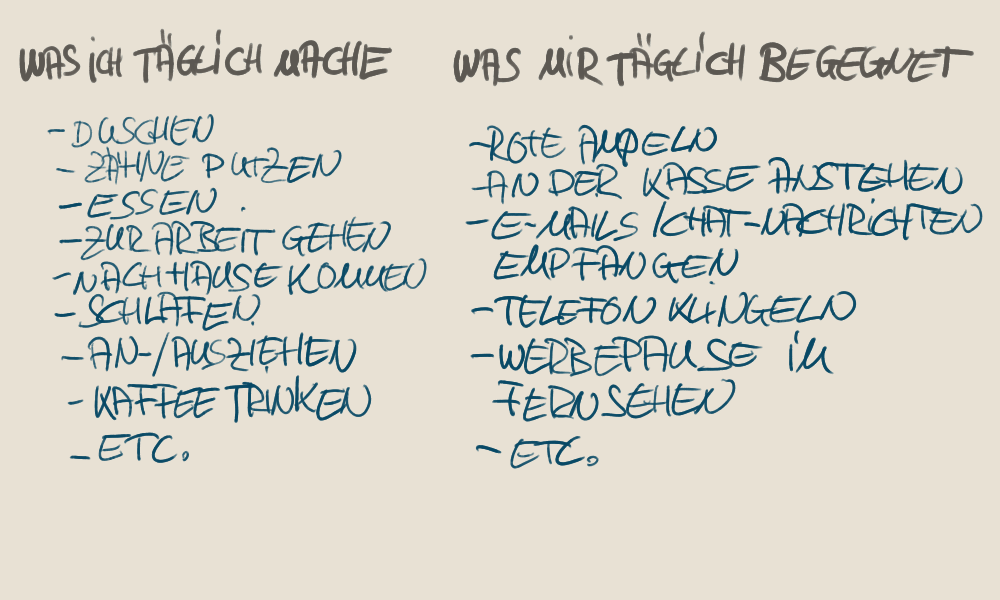

Abgehetzt nach einem weiteren stressigen Tag schleppst Du die Einkäufe in deine Wohnung. Dein keuchender Atem verleiht der Szene die akustische Dramaturgie einer Verfolgungsjagd zu Fuß.

Du denkst dir: „Echt jetzt? Will ich so mein Leben verbringen?“ Der Held des Treppenhauses, der versucht das Rennen gegen die Zeit zu gewinnen um bloß keine Sekunde, ja von was denn eigentlich, zu verpassen?

Das Highlight des Tages ist es, dich mit Junk-Food in deiner heimeligen Komfort-Zone einzumauern.

In diesem kurzen Aufleuchten der Selbsterkenntnis schlägt dann der Hammer der Motivation zu.
„So geht das nicht weiter! Es muss sich was verändern. Ich werde mich im Studio anmelden. Ich fange an zu Laufen. Ich werde meine begrenzte Lebenszeit ab jetzt sinnvoll verbringen.“

Du bist voller Energie, hoch motiviert.

Und dann?

Ein Jahr später ist das Treppenhaus immer noch die größte Anstrengung eines mit Belanglosigkeiten verplemperten Tages.

Das Feuer der Motivation ist schneller erloschen als ein Streichholz im Wind.

Du hast das abgebrannte Streichholz noch eine Weile mit dir herumgetragen, als Erinnerung.

Irgendwann hast Du es schließlich verloren.

Ist nicht schlimm. Es ist ja auch zu nichts zu gebrauchen.

Und das einzige Feuer, das dir noch bleibt ist das lodernde schlechte Gewissen in dir.

Doch wärmen tut es dich nicht.

Wir verlassen uns allzu oft auf unsere Motivation. Doch sobald die Motivation uns verlässt, denken wir, es mangelt uns an Willensstärke.

Motivation kann eine gute Starthilfe sein. Leider ist sie kein zuverlässiger Partner. Nutzen wir das Streichholz nicht um ein größeres Feuer zu entfachen, bleiben wir weiter in der Kälte stehen.

Egal wie viele Streichholzschachteln wir haben.

## VERGISS MOTIVATION!

Was wir brauchen ist Konsistenz.

Das Schöne daran ist, Du bist schon konsistent. Du musst dir dessen nur bewusst werden.
Wir sind alle Gewohnheitstiere. Wir folgen unseren Gewohnheiten, ohne auch nur einen Gedanken an Motivation oder Willensstärke zu verschwenden.
Wenn Du morgens aufstehst, fragst Du Dich nicht erst ob Du heute motiviert bist dir die Zähne zu putzen. Du machst es einfach.

Was könnten wir erst erreichen, würden wir unsere Lebensziele mit der gleichen Selbstverständlichkeit verfolgen?

## GEWÖHNLICHE GEWOHNHEITEN

Zunächst einmal sollten wir einen genaueren Blick auf unsere bestehenden Gewohnheiten werfen.

Im Prinzip sind sie nichts anderes als einfache Verhaltensmuster, die durch „Belohnungen“ immer weiter bestärkt werden. Hier arbeitet eine Feedbackschleife, die sich selber am Laufen hält.

Wir können Gewohnheiten aufteilen in: Auslöser, Handlung und Belohnung.

**Beispiel**: Allabendliches Fernsehen auf der heimeligen Couch sitzend.

*Mögliche Auslöser*: Feierabend, Abendessen beendet.

*Handlung*: auf der Couch sitzen oder liegen und Fernsehen. Belohnung: das Gefühl von unterhalten werden, sich nicht mehr aktiv mit seinem eigenen Alltag beschäftigen müssen.

Der Großteil unserer Gewohnheiten sind nicht in ganz so offensichtlichen Schleifen eingebunden. Auslöser sind nicht nur externe Reize. Der aktuelle Gemütszustand ist wahrscheinlich der mächtigste Einflussfaktor und Auslöser einer Vielfalt von Handlungen. Am bekanntesten sind sicherlich Frusthandlungen wie Frustessen und Frustshopping.

Die Belohnungen ihrerseits färben unser emotionales Erleben und können somit wieder weitere Handlungen auslösen. Durchlaufen wir diesen Kreislauf immer wieder, kann daraus eine komplexe Gewohnheit entstehen.

**Beispiel**: Ein stressiger Tag ist zu Ende. Erstmal ein Feierabendbier und vor der Glotze das Hirn mal auf Standby stellen.

Oft genug wiederholt, wird dieses Verhalten zur Gewohnheit und zum allabendlichen Ritual. Irgendwann einmal kommt der Punkt, an dem man sich einen anderen Verlauf des Abends nicht mal mehr vorstellen kann.

Wenn wir einmal unsere Gewohnheiten genauer betrachten und zu dem Schluss kommen, dass sie uns langfristig nicht nutzen und vielleicht sogar schaden, werden wir diese als „schlecht“ bezeichnen.

Falls wir also schlechte Gewohnheiten loswerden wollen, sollten wir diese zuerst analysieren: Was ist der Auslöser? Was ist die Belohnung? Dieses Wissen hilft uns diese Schleife zu durchbrechen.

Doch nicht jede Handlung wird belohnt. Sie kann auch „bestraft“ werden. Dann wird die Verknüpfung mit dem Auslöser geschwächt und die Wahrscheinlichkeit, dass die gleiche Handlung nochmal ausgelöst wird, sinkt.

**Beispiel**: Einen Korb bekommen.

*Möglicher Auslöser*: Du lernst einen äußerst interessanten und sympathischen Menschen kennen.

*Handlung*: Du fragst denjenigen, ob ihr nicht mal etwas Zeit zusammen verbringen wollt. Um euch näher kennenzulernen. Du bittest also um ein Date.

*Bestrafung*: Du wirst mehr oder weniger freundlich abgewiesen.

*Folge*: je häufiger dieses passiert, desto schwieriger wird es dir von Mal zu Mal fallen, jemanden um ein Date zu fragen. Letztendlich wirst Du es irgendwann nicht mehr machen.

Du kennst ja schon das Ergebnis.

## NEUE GEWOHNHEITEN

Wollen wir neue Gewohnheiten schaffen, müssen wir uns ihrer grundlegenden Anatomie bedienen. Den Kernpunkt bildet die Handlung. Was uns also noch fehlt, sind ein Auslöser und eine Belohnung.

Als Auslöser eignen sich am besten Situationen oder Sachen die uns täglich begegnen. Wenn es dein Ziel ist, mehr Liegestütze machen zu können, dann könntest Du beispielsweise Duschen als deinen Auslöser wählen. Unter die Dusche springst Du jeden Tag, da kannst Du vorher auch ein wenig schwitzen.

Um einen guten Auslöser für dich zu finden, erstelle dir am besten zwei Listen:

Mit diesen zwei Listen haben wir eine Unmenge an möglichen Auslösern an der Hand. Der Auslöser sollte natürlich zur Handlung passen. Wenn das Telefon klingelt, ist es natürlich unsinnig erstmal Tonleitern auf der Geige zu üben.

## HANDLUNG

Die Handlung selber sollte zunächst so einfach sein, dass man sie kaum ablehnen kann. Es ist viel zu leicht sich, von der Motivation getrieben, in zu großen Ambitionen zu verlieren, die Du letztlich dann doch nicht wieder durchhalten kannst. Am Ende fühlst Du Dich wieder von dir selber enttäuscht oder Du findest „gute Gründe“ warum das wohl doch keine so gute Idee war, Du halt nicht dafür geschaffen bist und eigentlich, ja eigentlich sowieso was ganz anderes willst oder ja gar nicht so unzufrieden mit deiner jetzigen Situation bist.

Das ist der Moment, in dem die Flamme der Motivation erlischt.

Am Anfang zählt nicht das Ergebnis, es geht zunächst nur darum überhaupt eine neue Gewohnheit zu schaffen. Mach es dir so leicht, dass Du nicht Nein sagen kannst. Mach nur einen Liegestütz. Das wichtigste ist und bleibt, dass Du es machst. Nicht, wie viel oder wie lange.

Meistens passiert folgendes: wenn Du schon mal angefangen hast, dann machst Du auch ein wenig mehr. Bist ja eh schon dabei. Machst dann vielleicht zwei Liegestütze oder drei oder zehn.

In meiner Studienzeit ging mir das mit dem Schreiben immer so. Eine unangenehme Aufgabe über etwas zu schreiben, was einen vielleicht nicht immer interessiert und dann auch noch bewertet wird. Das beste Mittel gegen diese Unlust war schlicht anzufangen. Irgendetwas zu schreiben.

Ich habe mir gesagt: „Schreib einfach eine halbe Seite.“ Ohne eigene Bewertung des Geschriebenen. Manchmal habe ich einfach nur beschrieben, was ich um mich herum sehe oder irgendeinen Quatsch der mir gerade durch den Kopf ging. In der Regel habe ich kaum eine ganze Seite gebraucht um mich dann dem Thema zu widmen, welches ich bearbeiten sollte. Der Knackpunkt ist, erst einmal überhaupt in Bewegung zu kommen, anzufangen. In Bewegung zu bleiben ist dann deutlich leichter.

Eine große Hilfe dabei ist es, statt an das Ergebnis an das Ereignis zu denken. Das heißt, statt daran zu denken, dass ich noch fünfzehn Seiten schreiben muss, denke ich daran zu schreiben. Und wenn es nur zehn Minuten werden. So erscheint zum einen die vor uns liegende Aufgabe nicht mehr so unglaublich groß und anstrengend und man kommt viel leichter in Bewegung. Zum anderen, selbst wenn Du nur ein kleines Bisschen geschafft hast, hast Du die neue Gewohnheitsschleife weiter gestärkt.

**Anderes Beispiel**: Du hast dir vorgenommen heute eine Stunde Laufen zu gehen. Doch es kam zu Verzögerungen. Bist auf Arbeit aufgehalten worden, hast noch einen Anruf bekommen, was auch immer. Jetzt geht dein Zeitplan nicht mehr auf. Die meisten würden den Lauf jetzt bleiben lassen. Ich habe mir eine Stunde vorgenommen, das schaff ich nicht mehr, also lass ich es bleiben. Das ist Ergebnisdenken. Die Folge ist, deine Gewohnheitsschleife wird somit geschwächt. Beziehungsweise die Handlung nach dem Auslöser (zum Beispiel Feierabend) wird durch eine andere ersetzt.

Denkst Du aber hauptsächlich an das Ereignis, gehst Du dennoch Laufen und seien es nur 15 – 20 Minuten. So stärkst Du diese Gewohnheitsschleife. Du wirst mit einem guten Gefühl, statt schlechtem Gewissen, belohnt.

Da wir gerade davon sprechen:

## BELOHNUNG

Belohne dich selber.

Jedes Mal, wenn Du Deiner neuen Gewohnheit folgst, solltest Du Dich belohnen. Eine der einfachsten und effektivsten Möglichkeiten ist es, sich selber zu loben. Der große Vorteil ist, dass so deine Belohnung immer verfügbar ist. Hast Du Dein Liegestützprogramm durchgezogen? „Gut gemacht!“ oder bist Du im Fitness Studio fertig „Das war ein gutes Training“. „Gute Arbeit!“ oder ähnliches.

Eigenlob stinkt nicht! Solange man es für sich behält.

Anfänglich kann das für dich sicher eine ganz schöne Herausforderung sein. Aber denk mal daran, wie einfach es ist sich selber mit negativen Gedanken zu „bestrafen“: „Oh Mann, das ist wieder schiefgegangen!“ „Ich kann das nicht!“, „Mist! Ich habe es wieder nicht geschafft!“ etc. pp.

Diese Art des Selbstgespräches fällt uns meistens deutlich leichter. Leider. Also, wenn Du Dir komisch vorkommst „Gut gemacht!“ zu dir selber zu sagen, dann denk dran, wie leicht es dir fällt mit dir selber zu schimpfen.

Du tust das Gleiche, nur der Inhalt verändert sich. Bonuspunkte gibt es, wenn Du es laut aussprichst.

## NEUE GEWOHNHEITEN IM ALTEN ALLTAG

Das Wissen darum wie man neue Gewohnheiten aufbaut, ist die eine Sache, dies in den eigenen Alltag zu übertragen ist oftmals wieder eine andere Geschichte.

Veränderungen sind nicht leicht. Schlagen die Wellen des Alltages hoch, wird es schwierig auf Kurs zu bleiben.

Du hast jetzt das „Geheim“ Rezept zur erfolgreichen Gewohnheitsänderung.
Die Zutaten:

+ alltägliche Auslöser (siehe Liste 1 und 2)
+ eine Handlung die so klein, ist dass Du nicht Nein sagen kannst
+ Belohnung (Eigenlob)

So viel zum Rezept. Jetzt kommen wir zum „geheimen“ Teil: Konsistenz.

Unsexy. Ich weiß. Doch Konsistenz schlägt Intensität auf Dauer um Längen.
Intensität brennt dich auf Dauer aus. Strategisch und bewusst eingesetzt kann es jedoch eine wunderbare Methode sein, um weiter zu kommen. Aber eben nur vor dem Hintergrund einer langfristigen Planung. Zur Schaffung neuer Gewohnheiten ist Konsequenz der Intensität deutlich vorzuziehen.

Jetzt kannst Du Dir einen Plan erstellen, der dich konsistent näher an dein Ziel bringt. Konzentrier dich auf das Tun und weniger auf das Ergebnis.

Durch Konsistenz nutzen wir das Prinzip der Summation.

+ Wenn du täglich 1000 Wörter schreibst, wirst du nach einem Jahr besser schreiben können.
+ Wenn du täglich eine halbe Stunde dich bewegst, wirst du nach einem Jahr in deutlich besserer körperlicher, aber auch mentaler Verfassung sein.

Dies sind alles keine riesigen Aufgaben, es sind Kleinigkeiten, die aber in ihrer Summe großes vollbringen können.

## SCHLÜSSELGEWOHNHEITEN

Oft haben wir mehr als einen Aspekt des Lebens, den wir verändern möchten. Du kannst aber nicht auf mehreren Hochzeiten gleichzeitig tanzen. Wie sollst Du Dich nun also entscheiden?

Schlüsselgewohnheiten sind die Antwort.

Das heißt eine Gewohnheit, eine Routine, welche sich positiv auch auf andere Aspekte des Lebens auswirkt.

**Ein Beispiel**: Wenn ich regelmäßig trainiere, hat das nicht nur Auswirkungen auf meine körperliche Leistungsfähigkeit.

Training hilft mir meine Gedanken zu denken, zu sortieren. Gibt mir also mentale Auszeit vom Alltag.

Training erschöpft mich körperlich, so kann ich besser schlafen und bin morgens auch schneller auf der Höhe.

Training gibt mir das Gefühl der Kontrolle über mich und mein Leben wieder.

Wenn ich eine Zeit lang nicht trainieren konnte, dann passiert genau das Gegenteil. Ich fühle mich morgens genauso erschlagen, wie abends als ich ins Bett gegangen bin. Ich bin gereizter und dünnhäutiger, einfach nicht mehr so belastbar. Ich werde insgesamt lust- und antriebsloser. Ich fange an mehr Junk-Food in mich hineinzustopfen und so weiter.

Meine Schlüsselgewohnheiten sind Schreiben und Training. Wenn ich diese konsequent durchführe, geht es mir gut und ich komme auch meinen anderen Zielen im Leben näher. Das Schöne daran ist, es fühlt sich alles nicht mehr so anstrengend an.

Der größte Fehler ist es wohl aus Entscheidungsfaulheit gar nichts zu machen, als mit etwas zu beginnen, was eventuell noch nicht das optimale ist.

Welches sind deine Schlüsselgewohnheiten? Was ist die eine Sache, die deinen Tag insgesamt zu einem besseren macht? Laufen, Training, Meditation, Häkeln, Zeichnen, Lesen, Musizieren?

Egal was es ist, es lohnt sich Zeit darauf zu verwenden. Denn diese Schlüsselgewohnheiten, wenn Du sie regelmäßig durchführst, werden dich und dein Leben verändern.

## WENN MAN MAL EINEN RÜCKSCHLAG HAT

Gewohnheiten bilden steht und fällt vor allem mit der Fähigkeit mit Rückschlägen umgehen zu können. Das Leben passiert eben. Es wird immer Zeiten geben in denen Du Deine neuen Gewohnheiten vernachlässigst oder nicht durchführen kannst.
Doch Stolpern macht Dich nicht zum Versager, es macht Dich menschlich.
Auch die erfolgreichsten Menschen kommen mal von ihrem Pfad ab. Was sie erfolgreich macht, ist aber nicht, keine Fehler zu machen, sondern die Fähigkeit wieder weiterzumachen und schnell wieder zum gewollten Verhalten zurückzukehren. Das wichtige dabei ist eben nicht Fehler zu vermeiden, sondern sie zu akzeptieren, diesen Fall vorherzusehen und dafür zu planen.

Pack die deine neuen Gewohnheiten am besten in den Kalender. Dann sind sie definitiv geplant. Wie auch deine sonstigen Termine. Da sagst Du Dir ja auch nicht: Ich sollte wirklich mal zu diesem Meeting, Date, wasauchimmer gehen. Du hast einen Termin, also hast Du ein definitives Zeitfenster in deinem Tag dafür eingeplant. Genauso solltest du auch deine Schlüsselgewohnheiten planen.

Sich zu sagen: *„Ich will mich gesünder ernähren.“* Das gibt dir keine klare Anweisung zum Handeln. Deine Gewohnheiten brauchen eine Zeit und einen Ort in deinem Leben, damit sie wachsen können.

Willst Du konsequent schreiben? Dienstagabend 19.00 Uhr, Arsch auf Stuhl, Finger auf Tastatur. Zu dieser Zeit, an diesem Ort passiert es.
Du willst trainieren? Montag, Mittwoch, Freitag 18.00 Uhr. Wir sehen uns im Studio.
Du willst laufen? Dienstag, Donnerstag, Sonntag 9.00 Uhr. Ich sehe dich im Park.

Es fühlt sich gut an sich zu sagen, dass man etwas verändern will. Werde spezifisch, das macht das Ganze erst real und es gibt dir den Rahmen, die Erinnerung und die Zeit um wieder zurück auf den Weg kommen zu können, falls Du mal von diesem abgekommen bist.

Bald, ist keine Zeit. Etwas, ist keine Zahl. Wann und wo genau wirst Du was tun? Hast Du ein System, welches dich automatisch daran erinnert (die Verknüpfung mit den anderen alltäglichen Sachen oder eine App oder ein Knoten im Taschentuch)?

Halte dich an deinen Plan. Auch wenn es nur im ganz Kleinen möglich ist. Denke an das Ereignis und weniger an das Ergebnis.

+ Keine Zeit für ein ganzes Training? Mach Liegestütze
+ Keine Zeit einen ganzen Artikel zu schreiben? Schreibe einen Absatz
+ Keine Zeit für eine Meditation? Mach Atemübungen
+ Keine Zeit für Urlaub? Mach einen Ausflug auf´s Land oder in eine andere Stadt

Finde einen Weg den Plan zu befolgen, auch wenn es nur im Kleinen möglich ist.

Diese Strategie erlaubt es dir, dir selber zu beweisen, dass Du am Ball bleibst. Selbst wenn die Umstände es dir schwer machen sollten. Das am Ball bleiben als solches summiert sich zu der Person, die Du werden willst und hilft dir deine langfristigen Ziele zu erreichen.

Eine weitere Strategie ist es für sich selber Regeln aufzustellen. Wie gesagt, das Leben passiert eben. Da kann schon mal eine Trainingseinheit ausfallen. Doch der Schweinehund wächst exponentiell. Wenn aus einer ausgefallenen Einheit, plötzlich fünf geworden sind, braucht es einer größeren Anstrengung wieder ins Training zu gehen. Daher die Regel: Es fallen nie mehr als zwei geplante Trainingseinheiten hintereinander aus. Komme was wolle, die Dritte findet statt.

## GESTALTE DEN RAUM UM DICH FÜR DEINEN ERFOLG

Alles was du siehst, liest, hörst. Alles was dich umgibt, beeinflusst dich. Wenn Du dich verändern willst, gestalte den Raum um dich herum so, dass deine Umgebung dich dabei unterstützt und dich nicht von deinem Vorhaben abhält oder dich hindert.

Wenn Du mehr Gitarre spielen üben möchtest. Dann stell die Gitarre so in der Wohnung hin, dass Du sie immer wieder im Blick hast. Ist sie im Koffer weggepackt und steht irgendwo in der Ecke, ist die Überwindung sie auszupacken und zu üben deutlich größer, als wenn Sie auf der Couch liegt, an der Du am Tag hundertmal vorbeiläufst. Der Kaffee braucht noch fünf Minuten? Das reicht für ein paar Fingerübungen oder Tonleitern.

Wenn du abnehmen willst, ist es nicht ratsam die Schüssel Chips auf dem Couchtisch stehen zu haben, den Schrank voller Schokolade und das Eisfach mit Eis gefüllt zu halten. Jetzt musst Du aktiv der Versuchung widerstehen. Hast Du es gar nicht im Haus, kann deine Faulheit dir eine Hilfe sein. Oder gehst Du nach dem Abendessen nochmal in den Supermarkt und holst dir dein Eis? Falls ja, dann kommst Du wenigstens deinem Tagesziel an Schritten näher.

Veränderungen können sehr anstrengend sein. Es geht drei Schritte vor, dann einen zurück. Wichtig ist, es geht auch dann immer noch vorwärts. Plane für diesen Schritt zurück. Damit Du wieder nach vorne gehen kannst.

Oder sieh es mal so: Um Anlauf nehmen zu können, muss man auch mal ein paar Schritte zurückgehen.

Zu guter Letzt bleibt nur noch eines: Mach es. Mit all diesen Ideen solltest Du in der Lage sein dir neue Gewohnheiten zu schaffen. Ist es leicht? Am Anfang nicht. Aber es wird leichter. Immer leichter. Versprochen.

Bleib bei deinem Plan: Bau dir ein System und entwickle Prozesse die dieses System aufrechterhalten. Überfordere dich nicht gleich von Beginn an.
Und wenn Du mal stolperst: aufstehen freundlich nicken und weiter tanzen.

Alles Wissen der Welt nutzt nichts, wenn Du es nicht in die Tat umsetzt. Wenn Du Ziele im Leben hast, die dir wichtig sind, dann kannst Du diesen Wegweiser nutzen um dich auf den Weg zu machen.

Eine letzte Umarmung, fühl dich gedrückt. Und jetzt los, mach deinen ersten Schritt.

